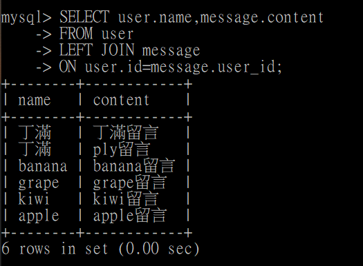
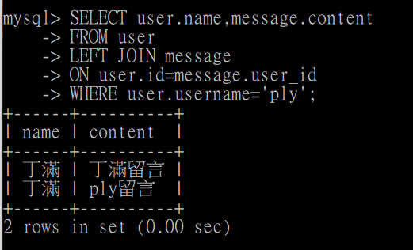

## 要求三
1. 使用 INSERT 指令新增一筆資料到 user 資料表中，這筆資料的 username 和 password 欄位必須是 ply。接著繼續新增至少 4 筆隨意的資料。  
  

2. 使用 SELECT 指令取得所有在 user 資料表中的使用者資料。  

3. 使用 SELECT 指令取得 user 資料表中總共有幾筆資料。

4. 使用 SELECT 指令取得所有在 user 資料表中的使用者資料，並按照 time 欄位，由近到遠排序。

5. 使用 SELECT 指令取得 user 資料表中第 2 ~ 4 共三筆資料，並按照 time 欄位，由近到遠排序。

6. 使用 SELECT 指令取得欄位 username 是 ply 的使用者資料。

7. 使用 SELECT 指令取得欄位 username 是 ply、且欄位 password 也是 ply 的資料。

8. 使用 UPDATE 指令更新欄位 username 是 ply 的使用者資料，將資料中的 name 欄位改成【丁滿】。

9. 使用 DELETE 指令刪除所有在 user 資料表中的資料。

---
## 要求四
1. 使用 SELECT 搭配 JOIN 的語法，取得所有留言，資料中須包含留言會員的姓名。  
  
2. 使用 SELECT 搭配 JOIN 的語法，取得 user 資料表中欄位username 是 ply 的所有留言，資料中須包含留言會員的姓名。
